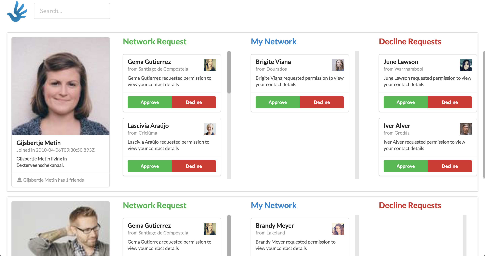

# humans

Abstract social network functionality test application

TODO: 
1. __Общий вид приложений и настройка TS__
2. __Опрделить базовый тип Humans, определение полей__
3. __Добавление и удаление пользователя в свою Сеть__
4. __Поиск по имени карточки верхнего уровня__
5. Поиск внутри items (увы, не могу представить как быстро и красиво отображать это на фронте). Сам поиск и смапить дату проблем не сотавляет.
6. Не успел сделать ничего из истории. На данный момент есть типы событий, я могу их записывать в стор и показывать, но навигацию по ним и оторажение представить не смог.


### PS
Время потрачано около 12 плотных часов. Некоторые вещи осваивал чуть ли не с нуля, но было интересно и полезно. Очень сожалею, что не смог предоставить полностью выполненное задание. 

Надюсь затрачено время и последняя практика с TS около года назад, помогут дать вам объективную оценку

### Stack
- Vue 
- TypeScript
- Semantic UI



## Build Setup

```bash
# install dependencies
$ yarn install

## Project setup
```
npm install
```

### Compiles and hot-reloads for development
```
npm run serve
```

### Compiles and minifies for production
```
npm run build
```

### Lints and fixes files
```
npm run lint
```

### Customize configuration
See [Configuration Reference](https://cli.vuejs.org/config/).
